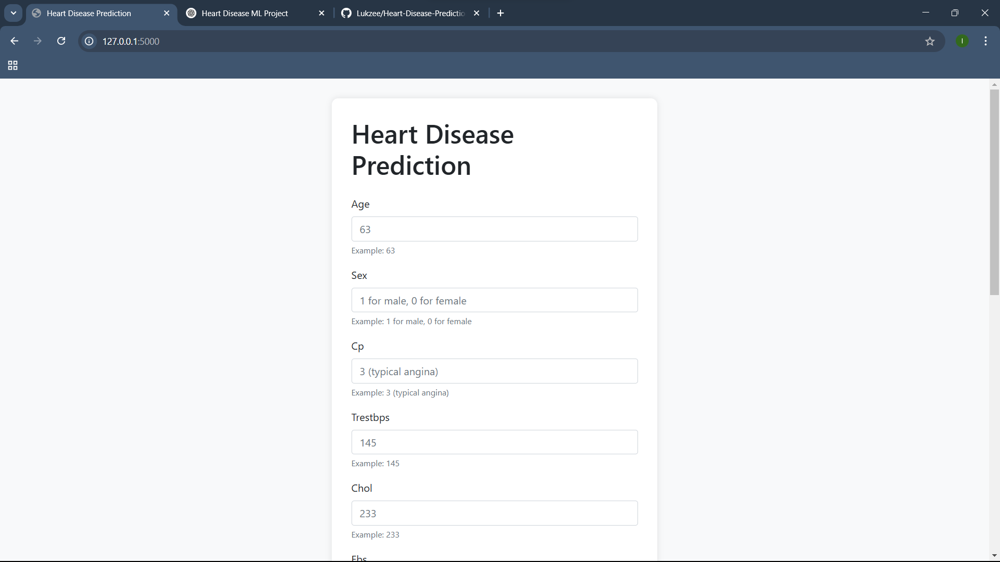
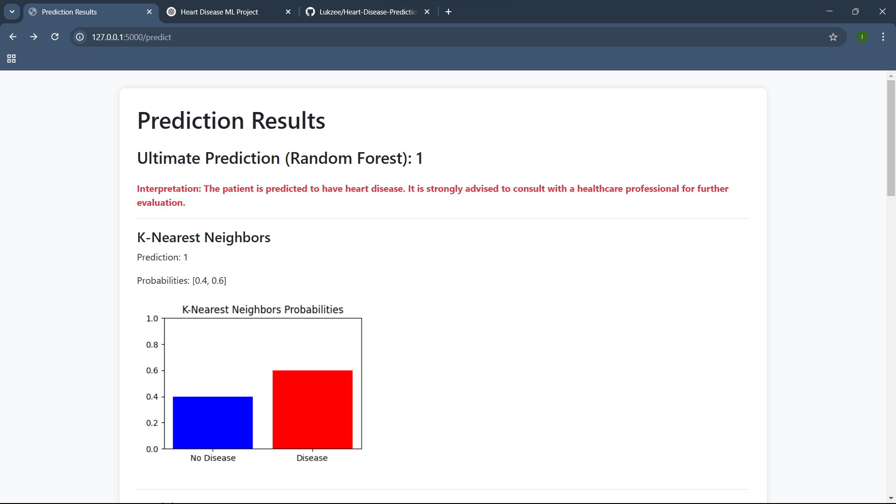
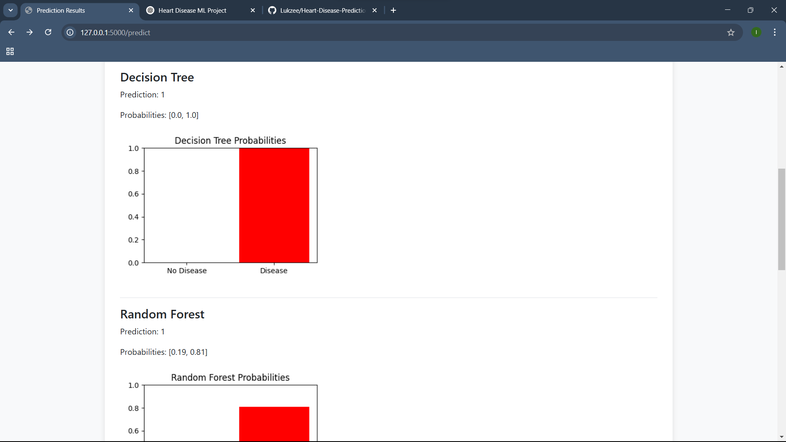

# Heart Disease Prediction Web Application

A Python-based web application that predicts heart disease using multiple machine learning algorithms and provides an interactive, user-friendly interface for data input and prediction visualization. This project is a Flask web application with an attractive UI using Bootstrap.

## Overview

This web application:
- Accepts patient data inputs via a simple, well-designed web form.
- Uses five machine learning algorithms to predict the presence or absence of heart disease:
  - **K-Nearest Neighbors (KNN)**
  - **Decision Tree**
  - **Random Forest** (used as the ultimate prediction due to its highest accuracy)
  - **Support Vector Machine (SVM)**
  - **Logistic Regression**
- Generates and displays a probability bar graph for each model's prediction.
- Provides a final interpretation statement based on the Random Forest prediction.

## Features

- **Interactive UI:** A clean and responsive form for data entry enhanced with sample hints and placeholders.
- **Multiple Model Predictions:** Each algorithm's prediction is displayed separately with corresponding probability graphs.
- **Final Interpretation:** The Random Forest model prediction is highlighted as the final outcome with an interpretation message.
- **Extensible and Modular:** Easily update or add new models, UI enhancements, or data processing features.

## Requirements

- Python 3.6 or later
- Flask
- scikit-learn
- pandas
- numpy
- matplotlib

## Installation

1. **Clone the Repository:**

   ```bash
   git clone https://github.com/Lukzee/Heart-Disease-Prediction.git

2. **Create and Activate a Virtual Environment:**

    ```bash
   python -m venv venv
    # On Windows:
    venv\Scripts\activate
    # On macOS/Linux:
    source venv/bin/activate

3. **Install Dependencies:**

    ```bash
   pip install -r requirements.txt
    
   #Or install dependencies manually:
   pip install flask pandas numpy scikit-learn matplotlib

4. Download Dataset:

    Ensure that the heart.csv file (from the UCI Heart Disease dataset) is present in the project root directory.

## Running the Application

1. **Start the Flask Application:**

    ```bash
   python app.py

2. **Access the Web App:**

    Open your browser and navigate to http://127.0.0.1:5000.

## Project Structure

    Heart-Disease-Prediction/
    ├── app.py                   # Main Flask application file
    ├── heart.csv                # Heart disease dataset
    ├── requirements.txt         # List of Python dependencies (optional)
    └── templates/
        ├── index.html           # Input form page with hints and sample data
        └── result.html          # Results page displaying model predictions and graphs

## UI Screenshots

### Input Form


*This screenshot shows the input form with sample hints, placeholders, and a clean design.*

### Prediction Results



*This screenshot displays the model predictions along with probability graphs and a final interpretation.*

## Usage

1. Enter Patient Data:
Fill in the form with patient details. Each field has a sample value as a hint. 
2. Submit for Prediction:
Click the Predict button to trigger the model predictions. 
3. View Results:
The results page will display the predictions and probability graphs for each algorithm, along with a final interpretation based on the Random Forest prediction.

## Future Enhancements

* Model Optimization: Pre-train and save models to reduce prediction latency.
* Data Validation: Implement robust error handling and data validation on the input form.
* UI Improvements: Enhance the UI further with custom CSS and JavaScript animations.
* Deployment: Configure for production using a WSGI server like Gunicorn and containerize using Docker.

## License

This project is licensed under the MIT License.

## Acknowledgments

* UCI Machine Learning Repository for the dataset.
* Scikit-Learn for the machine learning models and utilities.
* Flask for the web framework.

## Author

**Ibrahim Lukman (AKA Tenn Whiterose | LazyCoder)**  
GitHub: [Lukzee](https://github.com/Lukzee)  
Twitter|X: [l9z1c0d9](https://x.com/l9z1c0d9)  
Email: ibrahimlukman189@gmail.com


Feel free to contribute or suggest improvements. Enjoy building and predicting!


    ---

    This README provides clear instructions on the purpose of the project, setup, usage, and future improvements. You can add your screenshots to a `screenshots` folder and update the paths accordingly before uploading to GitHub.
